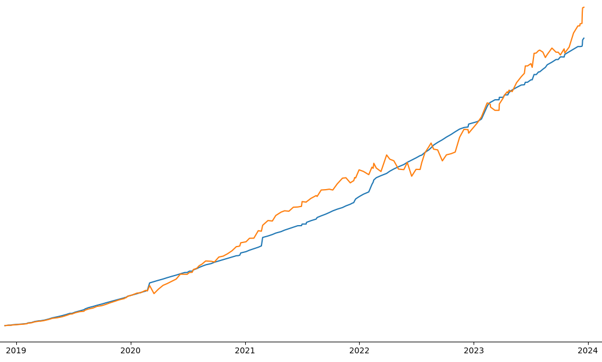

# Empower-Extractor
> An _unoficial_ CLI tool enabling easy export of detailed transaction records from your Empower Retirement Account. 

# Installation
1. Download `empower-transaction-retrieval.py` and `requirements.txt` to your machine
2. Install the requirements using `pip install -r requirements.txt`

# Getting Started 
## Authentication
Because this tool has no authentication functionality yet, you will need to log into Empower and navigate to your transaction history page. The URL should look something like this: https://participant.empower-retirement.com/participant/accounts/#/account/{{INDID}}/{{GAID}}/transaction-history

Once you are here, create a new file in the same folder as `empower-transaction-retrieval.py` called `.env`. Inside you'll paste the following code: 
```toml
COOKIE=""
GAID=""
INDID=""
```
We will now fill in these three values. The GAID and INDID can be found in your url and shouldn't change over time. The first number is your INDID and the second number (including the dash) is the GAID. 

The Cookie will need to be retrieved from the developer tools each time your session expires. Open the developer tools up (press F12 on the keyboard) and then navigate to the network tab. After this, click on one of your transaction numbers on the website. You should see a few rows of data on the network tab. Click on the one that contains your GAID and INDID in the `file` column. Then, scroll down on the new pane to where you see the `cookie` value under the `request headers` header. Right click and "copy value" on the cookie entry. You can then paste this into the `COOKIE` value in your `.env` file. 

## Your First Request
In your command line, run the following code: 
```python empower-transaction-retrieval.py -s "01-JAN-2023" -e "01-FEB-2023"```

## Plotting your contributions vs. ROI
you will first need to retrieve your transaction data with the `empower-transaction-retrieval.py` command. Then you can run `python return-stats.py`. This will generate a example chart like the one below: 
. While there are many ways to calculate/visualize your ROI of investing - this one has been chosen for its ability to be easily understood. 

# Contributing
This was a project meant to serve my own needs. Currently, I don't plan to make many updates to this. That said, please don't hesitate to submit issues and PRs and I will try my best to provide updates when I can! 
